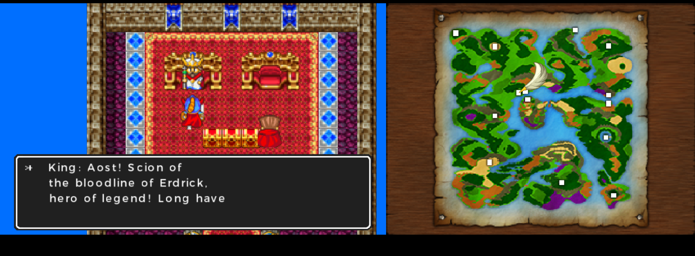
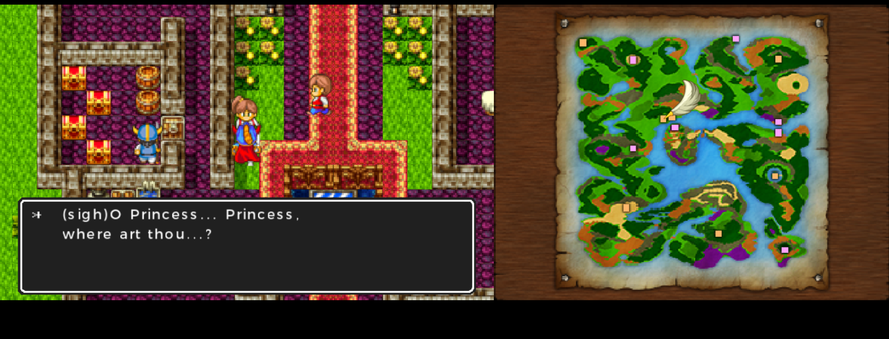
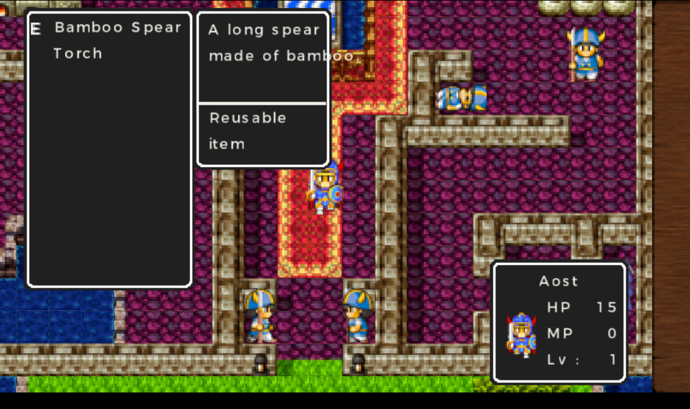
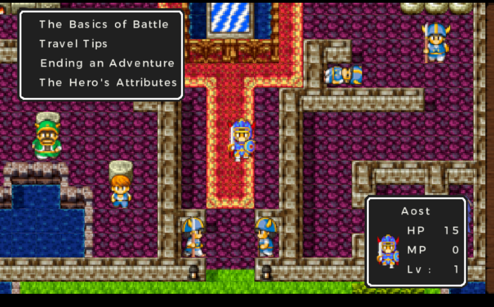
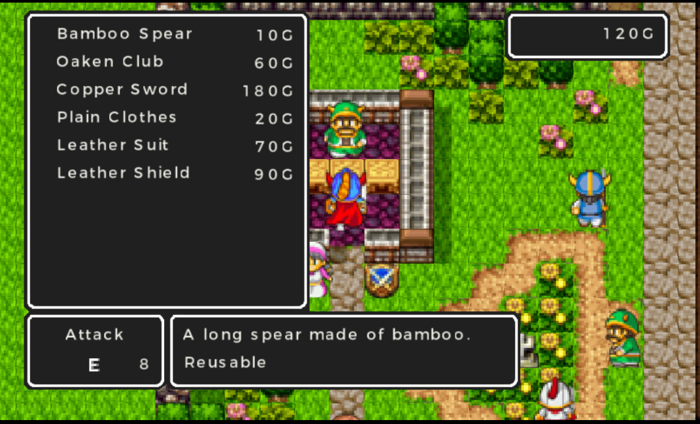
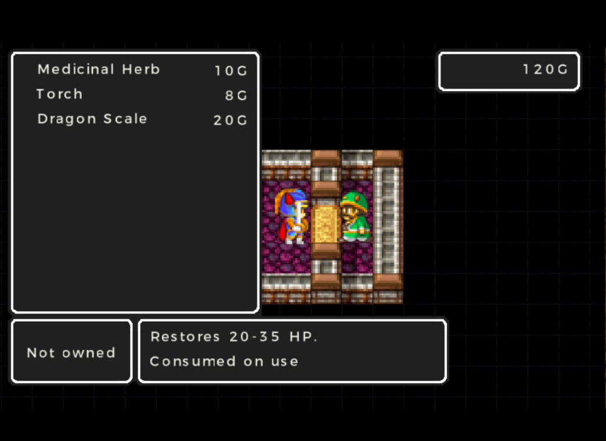
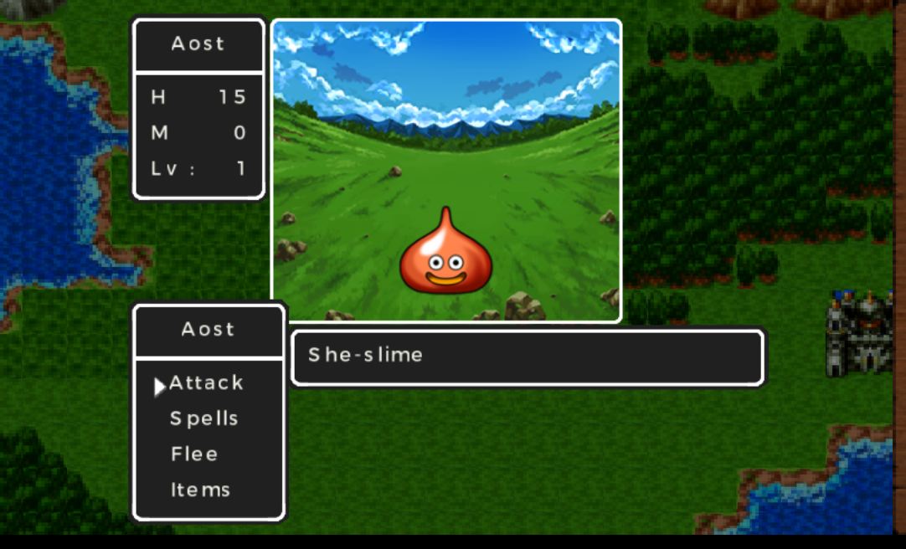
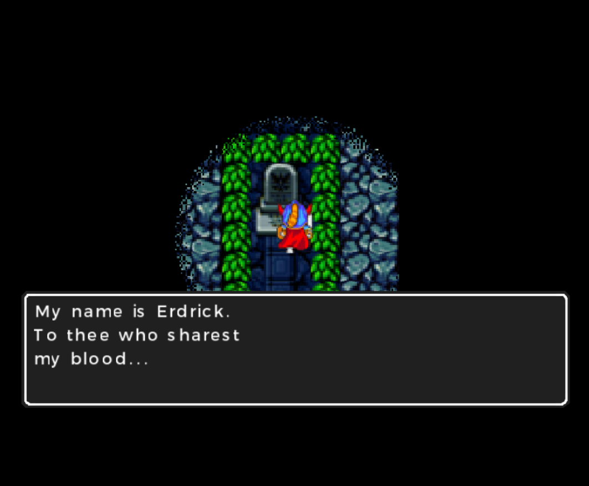
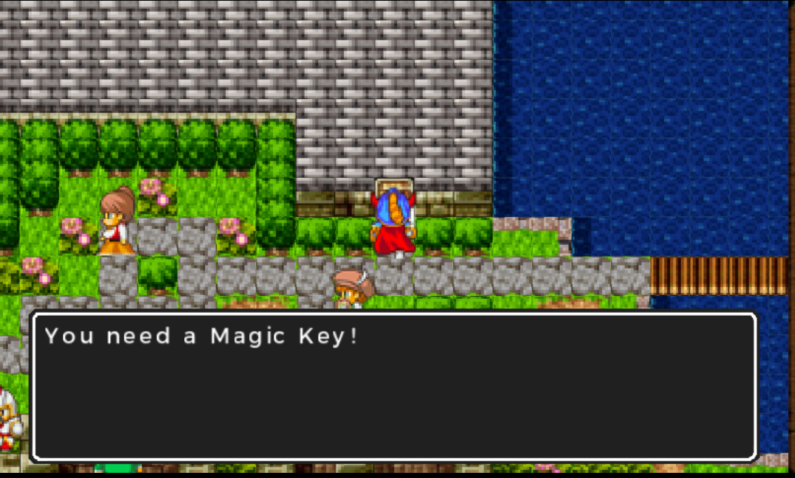

# Dragon Quest I: English Translation for Nintendo 3DS

An English patch for the Japanese Nintendo 3DS release of Dragon Quest I, assembled by TopCatHack (2026). It adapts the official English script from the Nintendo Switch version and translates the 3DS interface.

## Status

Beta testing. Early gameplay has been tested in Azahar, including conversations, battles, shopping, the inn, leveling up, and saving. A full playthrough and testing on real Nintendo 3DS hardware remain pending.

## What is translated

Story dialogue, battle messages, item and equipment names and descriptions, menus, and the Adventure Guide. Name entry uses Latin characters.

## Known issues and TODO

Some text exceeds its intended space. Further testing is needed to identify remaining Japanese text, layout problems, and issues later in the game.

## Downloads and installation

[**Download the DQ1 English beta patch**](https://github.com/topcatromhacking-lgtm/dragon-quest-1-3ds-english/raw/refs/heads/main/downloads/DQ1_3DS_English_Beta.zip)

You need your own copy of the Japanese Nintendo 3DS game, Title ID `00040000001C3700`. The same patch files work with Azahar and Luma3DS. The ZIP includes detailed instructions in `README.txt`.

### Azahar

Stop the game and extract the ZIP. Right-click Dragon Quest I in the game list and open its Mods Location. Copy `code.ips` and the `romfs` folder from inside `00040000001C3700` directly into that location. Do not nest another Title ID folder inside it.

```text
load/mods/00040000001C3700/code.ips
load/mods/00040000001C3700/romfs/retro1_res.dat
```

Launch the Japanese game normally.

### Luma3DS (Nintendo 3DS / 2DS)

With the console powered off, copy the entire `00040000001C3700` folder from the ZIP to `/luma/titles/` on the SD card.

```text
SD:/luma/titles/00040000001C3700/code.ips
SD:/luma/titles/00040000001C3700/romfs/retro1_res.dat
```

Hold SELECT while powering on, enable **Enable game patching**, and save the configuration with START. Launch the installed Japanese game from the HOME Menu. Real hardware testing remains pending.

### Updating or disabling the patch

Stop the game before replacing files and back up your normal saves. Remove an old `code.bin` override from this game's patch folder before using `code.ips`. To disable the translation, move this game's `code.ips` and `romfs` folder out of the patch location.

### Package checksum

SHA-256 for `DQ1_3DS_English_Beta.zip`:

```text
ad98824932766d65293880638b7944ceea7c615f1bef0004da72a08ca46253cc
```

## Screenshots

Screenshots from the beta running in Azahar.

| Dialogue | Dialogue and map | Inventory |
| --- | --- | --- |
|  |  |  |

| Adventure Guide | Equipment shop | Item shop |
| --- | --- | --- |
|  |  |  |

| Battle | Erdrick's message | Exploration |
| --- | --- | --- |
|  |  |  |

## Reporting problems

Open an issue with the patch version, location, steps to reproduce the problem, and a screenshot. A normal in-game save is helpful when available.

## Credits

Assembly, interface translation, adaptation, and testing: TopCatHack (2026).

Original game and official English localization: Square Enix and the original development and localization teams.

AI assisted with technical analysis, patch development, and troubleshooting.

This is an unofficial fan project, distributed free of charge. It must not be sold. Dragon Quest belongs to its respective rights holders.
